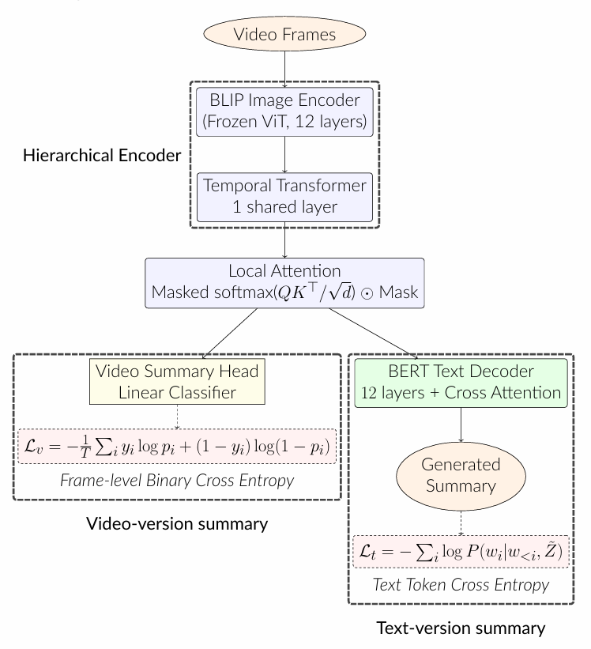

# Vision LLM-based Cross-modal Summarization Framework for Long-range Videos

**This repository contains an enhanced implementation of cross-modal video summarization, building upon the VideoXum framework with novel improvements including Local Attention Module and additional enhancement modules.**

[[Original VideoXum Paper](https://arxiv.org/pdf/2303.12060.pdf)] [[VideoXum Dataset](https://huggingface.co/datasets/jylins/videoxum)] [[VideoXum Model Zoo](https://huggingface.co/jylins/vtsum_blip)]

**Project Poster:** [View PDF](EECS_545_Poster.pdf) | [View Project Report](EECS_545_Project_Report.pdf)

> For a quick overview of this project, please refer to the [project poster](EECS_545_Poster.pdf).

## Overview

This project presents an enhanced cross-modal video summarization framework that addresses key limitations in existing video summarization methods. While state-of-the-art LLM-based techniques have made remarkable progress, existing methods often treat visual and textual summaries as separate tasks, ignoring semantic correlations between modalities. This deficiency becomes severe especially for long-range videos, which require better cross-modal information understanding.

**Key Contributions:**
- **Local Attention Module**: A novel attention mechanism that captures fine-grained temporal transitions and local context from neighboring frames, enabling better cross-modal semantic alignment
- **Memory-Augmented Transformer**: Enhanced transformer architecture with learnable memory banks for improved representation learning
- **Additional Enhancement Modules**: Event segmentation, summary refinement, ASR denoising, and adaptive feature extraction modules
- **Improved Performance**: Consistent gains across multiple evaluation metrics, particularly in semantic coherence and cross-modal alignment

> **Note:** Due to GitHub's file size limitations, some code files may not be fully uploaded to this repository.

## What is Cross-modal Video Summarization?

Cross-modal video summarization extends traditional single-modal approaches by creating summaries that contain both visual and textual elements with semantic coherence. Unlike methods that treat visual or textual summaries independently, our framework learns joint representations that capture correlations between video content and text descriptions, producing more meaningful and readable summaries.



## Contents
- [Key Innovations](#key-innovations)
- [Architecture](#architecture)
- [Dataset](#dataset)
- [Requirements](#requirements)
- [Installation](#installation)
- [Training](#training)
- [Evaluation](#evaluation)
- [Results](#results)
- [Acknowledgements](#acknowledgements)

## Key Innovations

### 1. Local Attention Module (LocalAttenModule)

The **Local Attention Module** is our core innovation that addresses the challenge of capturing fine-grained temporal transitions in long-range videos. Unlike global attention mechanisms that attend to all frames, our local attention restricts attention to a fixed-size sliding window of neighboring frames.

**Key Features:**
- **Sliding Window Attention**: Each frame attends only to its nearby neighbors within a fixed kernel size (default kernel_size=5, attending to 5 frames: itself + 2 neighbors on each side)
- **Cross-modal Enhancement**: Enables the model to capture motion transitions and temporal dynamics more effectively
- **Semantic Alignment**: Improves correlation between video and text summaries by enhancing local context understanding
- **Computational Efficiency**: Reduces attention complexity from O(T²) to O(T·k) where k << T

**Implementation:**
- Located in `models/vit_video.py` (class `LocalAttenModule`)
- Integrated into `models/vtsum_blip.py` (class `VTSum_BLIP_TT_CA`)
- Uses masked attention: `A_loc = softmax(QK^T/√d) ⊙ M_LA · V`

### 2. Memory-Augmented Transformer

The **Memory-Augmented Transformer** (`modules/memory_transformer.py`) enhances the base model with learnable memory banks that store and retrieve contextual information:

- **Learnable Memory Bank**: Parameterized memory vectors that adapt during training
- **Attention-based Retrieval**: Uses dot-product attention to retrieve relevant memory content
- **Feature Fusion**: Concatenates and fuses memory-enhanced features with original embeddings

### 3. Additional Enhancement Modules

Our framework includes several auxiliary modules in the `modules/` directory:

- **Event Segmentation** (`event_segmentation.py`): Boundary prediction for event-level video segmentation
- **Summary Refinement** (`summary_refinement.py`): DPP-based selection and smoothing for high-quality summaries
- **ASR Denoiser** (`asr_denoiser.py`): BART-based denoising for automatic speech recognition outputs
- **Feature Extractor** (`feature_extractor.py`): Adaptive frame sampling using CLIP and Whisper ASR integration

## Architecture

Our framework builds upon BLIP (Bootstrapping Language-Image Pre-training) with the following hierarchical structure:

1. **BLIP Image Encoder**: Frozen ViT-B/16 encoder extracts frame-level spatial features
2. **Temporal Transformer (TT)**: Lightweight one-layer transformer models temporal dependencies
3. **Local Attention Module**: Captures local context from neighboring frames with sliding window attention
4. **Dual Decoders**:
   - **Video-Sum Decoder**: Linear classifier predicts frame-level saliency scores
   - **Text-Sum Decoder**: BLIP's causal transformer decoder generates textual summaries

The overall loss combines both objectives:
```
L = λ_v · L_v + λ_t · L_t
```
where λ_v = 15.0 and λ_t = 1.0 in our experiments.

## Dataset

We use the **VideoXum dataset** for training and evaluation. The dataset comprises over 14,000 long-range videos from ActivityNet Captions, each paired with ten independent video-summary and text-summary annotations.

### Prepare Dataset

#### Download Source Videos
Download source videos from ActivityNet Captions dataset:
- Official website: [link](https://cs.stanford.edu/people/ranjaykrishna/densevid/)
- Huggingface: [link](https://huggingface.co/datasets/Leyo/ActivityNet_Captions)

#### Download VideoXum Annotations
Download VideoXum dataset from Huggingface: [link](https://huggingface.co/datasets/jylins/videoxum)

#### File Structure
```
dataset
└── ActivityNet
    ├── anno
    │   ├── test_videoxum.json
    │   ├── train_videoxum.json
    │   └── val_videoxum.json
    └── feat
        ├── blip
        │   ├── v_00Dk03Jr70M.npz
        │   └── ...
        └── vt_clipscore
            ├── v_00Dk03Jr70M.npz
            └── ...
```

## Requirements

- Python 3.8
- PyTorch == 1.10.1
- torchvision == 0.11.2
- CUDA == 11.1
- timm == 0.4.12
- transformers == 4.15.0
- fairscale == 0.4.4
- ruamel.yaml == 0.17.21
- CLIP == 1.0
- Other dependencies: pycocoevalcap, opencv-python, scipy, pandas, ftfy, regex, tqdm

## Installation

1. **Clone this repository:**
```bash
git clone <repository-url>
cd videoxum
```

2. **Create a conda virtual environment:**
```bash
conda create -n videoxum python=3.8 -y
conda activate videoxum
```

3. **Install PyTorch:**
```bash
pip install torch==1.10.1 torchvision==0.11.2 --index-url https://download.pytorch.org/whl/cu111
```

4. **Install core dependencies:**
```bash
pip install transformers==4.15.0
pip install fairscale==0.4.4
pip install timm==0.4.12
pip install ruamel.yaml==0.17.21
```

5. **Install CLIP:**
```bash
pip install git+https://github.com/openai/CLIP.git
```

6. **Install pycocoevalcap:**
```bash
cd pycocoevalcap
pip install -e .
cd ..
```

7. **Install other requirements:**
```bash
pip install -U scikit-learn
pip install opencv-python scipy pandas ftfy regex tqdm
```

## Results

Our enhanced framework with Local Attention Module achieves improved performance on the VideoXum test set:

| Metric | Baseline (TT+CA) | **Ours (TT+CA+Local Attention)** | Improvement |
|--------|------------------|----------------------------------|-------------|
| **F1** | 23.5 | **23.6** | +0.4% |
| **Kendall's τ** | 0.196 | **0.201** | +2.6% |
| **Spearman's ρ** | 0.258 | **0.269** | +4.3% |
| **BLEU@4** | 5.8 | **5.9** | +1.7% |
| **METEOR** | 12.2 | **12.4** | +1.6% |
| **ROUGE-L** | 25.1 | **25.1** | - |
| **CIDEr** | 23.1 | **25.4** | +10.0% |
| **VT-CLIPScore** | 29.4 | **29.6** | +0.7% |

**Key Improvements:**
- **Kendall's τ** (+2.6%): Better rank-level alignment with human annotations, indicating more accurate frame importance prediction
- **Spearman's ρ** (+4.3%): Improved correlation with ground truth saliency scores
- **CIDEr** (+10.0%): Significantly better at capturing distinctive and informative content in textual summaries
- **METEOR** (+1.6%): Enhanced semantic adequacy in generated summaries
- **VT-CLIPScore** (+0.7%): Improved cross-modal alignment between video and text summaries

These improvements demonstrate that the Local Attention Module effectively enhances the model's ability to capture fine-grained temporal transitions and produce more semantically coherent summaries.

## Training

### VTSUM-BLIP + Temporal Transformer (TT) + Context Attention (CA) + Local Attention

```bash
CUDA_VISIBLE_DEVICES='0,1,2,3' OMP_NUM_THREADS=1 python -m torch.distributed.run --nproc_per_node=4 train_v2vt_sum.py \
  --config configs/vtsum_blip_tt_ca.yaml \
  --output_dir outputs/vtsum_tt_ca \
  --model vtsum_blip_tt_ca \
  --max_epoch 56 \
  --lambda_tsum 1.0 \
  --lambda_vsum 15.0 \
  --init_lr 2e-5 \
  --kernel_size 5 \
  --batch_size 16 \
  --ckpt_freq 56
```

**Training Details:**
- Optimizer: AdamW (lr=2e-5, weight_decay=0.01)
- Gradient clipping: 1.0
- Batch size: 16
- Max text length: 32 tokens
- Frame sampling: 1 fps, 224×224 resolution

## Evaluation

### Evaluate with Local Attention Module

```bash
CUDA_VISIBLE_DEVICES='0,1,2,3' OMP_NUM_THREADS=1 python -m torch.distributed.run --nproc_per_node=4 eval_v2vt_sum.py \
  --config configs/vtsum_blip_tt_ca.yaml \
  --output_dir outputs/vtsum_tt_ca \
  --pretrained_model outputs/vtsum_tt_ca/vtsum_tt_ca.pth \
  --model vtsum_blip_tt_ca \
  --kernel_size 5
```

**Evaluation Metrics:**
- **Video Summarization**: F1, Kendall's τ, Spearman's ρ
- **Text Summarization**: BLEU@4, METEOR, ROUGE-L, CIDEr, VT-CLIPScore

## Acknowledgements

This project is built upon:
- [VideoXum](https://github.com/jylins/videoxum) - Original cross-modal video summarization framework
- [BLIP](https://github.com/salesforce/BLIP) - Vision-language pretrained model
- [ActivityNet Captions](https://cs.stanford.edu/people/ranjaykrishna/densevid/) - Video dataset foundation
